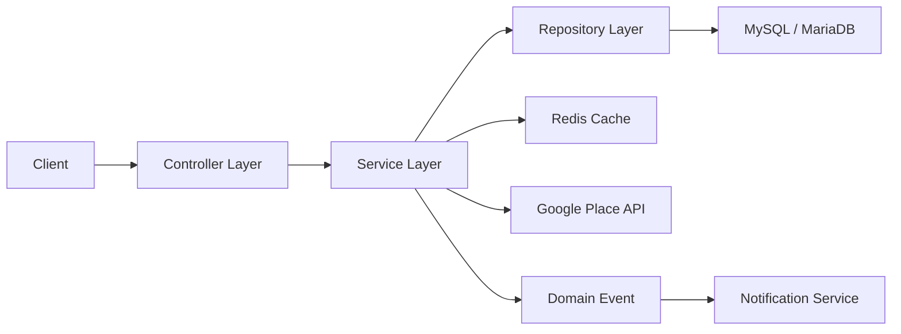
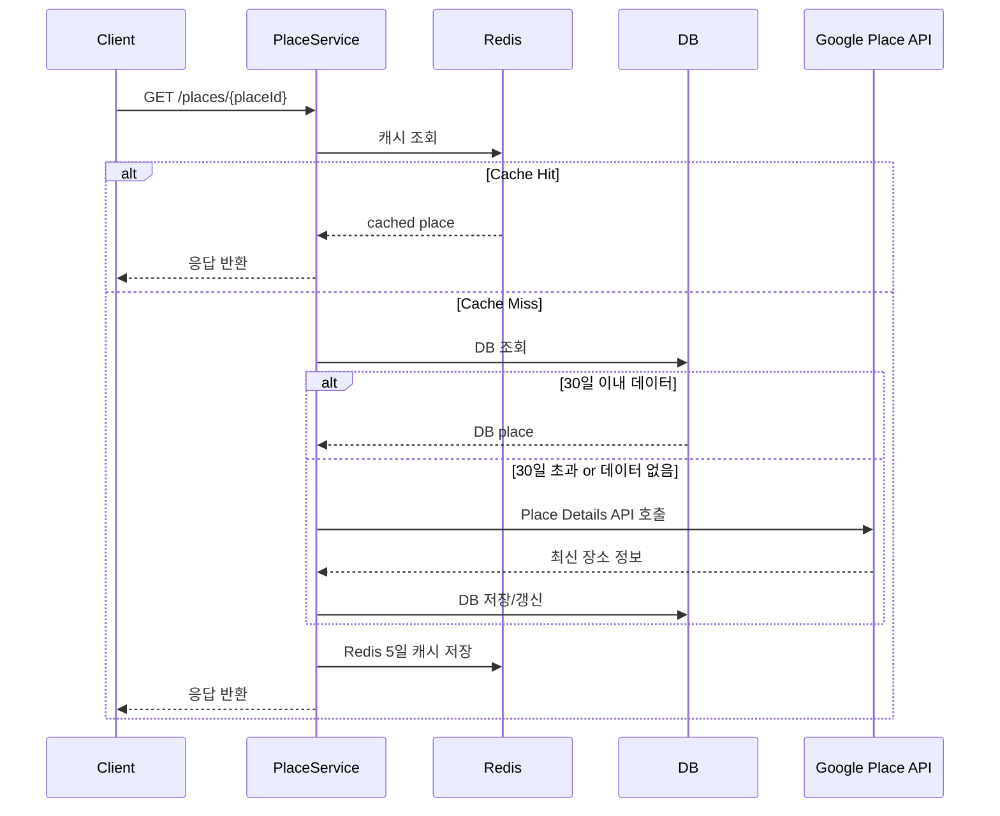
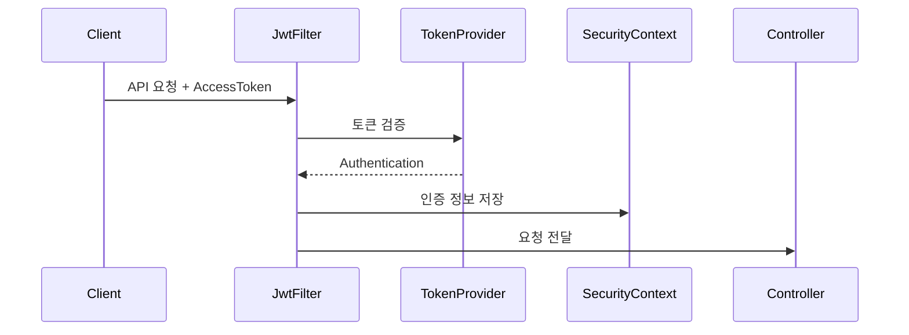

# Picnee Backend

일본 여행자를 위한 장소 리뷰·커뮤니티 서비스의 백엔드 프로젝트입니다.  
장소 상세 조회, 리뷰, 게시글, 댓글, 알림, 인증 기능을 중심으로 구성되어 있으며, 실제 서비스 운영을 고려해 `JWT 인증`, `Querydsl 기반 동적 조회`, `이벤트 기반 알림`, `Redis 캐시 + Google Place 재동기화 정책`을 적용했습니다.

## 프로젝트 한눈에 보기

| 항목 | 내용 |
| --- | --- |
| 프로젝트 성격 | 여행 커뮤니티 백엔드 |
| 핵심 도메인 | 사용자, 장소, 리뷰, 게시글, 댓글, 알림 |
| 아키텍처 | Layered Architecture + Domain Package Structure |
| 인증 방식 | JWT, OAuth2 |
| 조회 전략 | JPA + Querydsl |
| 최적화 포인트 | Redis 캐시, Google API 호출 정책 |
| 문서화 | Swagger / OpenAPI |

## 프로젝트 소개

Picnee는 일본 여행 중 방문한 장소에 대한 리뷰와 정보를 공유하고, 사용자 간 게시글과 댓글로 소통할 수 있는 여행 커뮤니티 서비스입니다.

이 백엔드 프로젝트는 단순 CRUD 구현에 그치지 않고 아래와 같은 실제 서비스 관점의 문제를 해결하는 데 초점을 두었습니다.

- 인증과 사용자 상태를 안정적으로 관리할 것
- 장소 조회에서 외부 API 비용과 데이터 최신성 사이의 균형을 맞출 것
- 리뷰/게시글/댓글/알림처럼 서로 연결된 도메인을 명확히 분리할 것
- 복잡한 조건 검색을 성능과 유지보수성을 고려해 구현할 것

## 핵심 구현 포인트

### 1. JWT + OAuth2 기반 인증 구조

- 이메일/비밀번호 로그인 지원
- OAuth2 로그인 지원
- Access Token / Refresh Token 발급 및 재발급
- Refresh Token은 Redis에 저장해 서버 측 검증 가능
- 컨트롤러에서는 `@AuthenticatedUser`를 통해 인증 사용자 정보를 직접 주입

인증 흐름은 세션이 아닌 토큰 기반으로 설계되어 API 서버를 stateless하게 운영할 수 있도록 구성했습니다.

### 2. Redis 캐시와 Google Place 재동기화 정책

장소는 `placeId`를 기준으로 관리하고, 장소의 기본 정보는 자주 바뀌지 않는다는 점을 활용해 조회 전략을 설계했습니다.

#### 조회 정책

- Redis에 `place:{placeId}` 형태로 장소 상세 응답을 캐시
- 캐시 TTL은 5일
- 캐시 miss 시 DB 조회
- DB 데이터의 `googleSyncedAt`이 30일 이내면 DB 데이터 반환
- 30일 초과 시 Google Place Details API를 다시 호출해 갱신 후 반환

#### 기대 효과

- 반복 조회 시 응답 속도 개선
- RDB 조회 부담 감소
- 불필요한 Google API 호출 비용 절감
- 데이터 최신성과 운영 비용 사이의 균형 확보

### 3. Querydsl 기반 동적 장소/게시글/리뷰 조회

복합 검색 조건과 정렬이 필요한 영역에는 Querydsl을 적용했습니다.

- 장소 목록: 지역, 타입, 정렬, 세부 필터 조합 조회
- 게시글 목록: 카테고리, 지역, 정렬 기준 조회
- 리뷰 목록: 최신순, 평점순 등 정렬 조회

단순 CRUD는 Spring Data JPA로 처리하고, 복잡한 조회만 커스텀 리포지토리로 분리해 책임을 나눴습니다.

### 4. 이벤트 기반 알림 처리

댓글 작성, 댓글 좋아요, 리뷰 평가처럼 다른 도메인에 영향을 주는 기능은 이벤트로 분리했습니다.

- 서비스 계층에서 이벤트 발행
- `@TransactionalEventListener`로 이벤트 수신
- 알림 생성 책임은 `NotificationService`로 집중

이 방식으로 댓글/리뷰 기능과 알림 저장 로직의 결합도를 낮췄습니다.

## 아키텍처

이 프로젝트는 기본적으로 `Controller -> Service -> Repository -> DB` 흐름을 따르는 계층형 구조입니다.  
다만 단순 계층 분리에 그치지 않고, 기능 단위로 패키지를 나누는 도메인 중심 패키징을 사용했습니다.



### 레이어별 역할

- Controller
  - HTTP 요청/응답 처리
  - DTO 바인딩
  - 상태 코드 반환
- Service
  - 비즈니스 규칙 처리
  - 트랜잭션 관리
  - 권한 검증
  - 이벤트 발행
- Repository
  - JPA CRUD
  - Querydsl 기반 동적 조회
- Entity
  - 도메인 상태와 핵심 행위 보유

## 대표 요청 흐름

### 장소 상세 조회



### 인증 요청 처리



## 기술 스택

### Backend

- Java 17
- Spring Boot 3.3.1
- Spring Web
- Spring Validation
- Spring Security
- Spring OAuth2 Client

### Persistence

- Spring Data JPA
- Hibernate
- Querydsl
- MySQL / MariaDB
- H2(Test)

### Infra

- Redis
- JJWT
- P6Spy

### Docs / Build

- Springdoc OpenAPI
- Swagger UI
- Gradle
- Lombok

## 프로젝트 구조

```text
src/main/java/com/picnee/travel
├─ api
│  ├─ *Controller
│  └─ in
├─ domain
│  ├─ user
│  ├─ place
│  ├─ review
│  ├─ post
│  ├─ postComment
│  ├─ notification
│  └─ ...
└─ global
   ├─ config
   ├─ exception
   ├─ jwt
   ├─ oauth
   ├─ redis
   └─ security
```

## 주요 API 영역

- `/users`
  - 회원가입, 로그인, 사용자 정보 수정, 중복 확인
- `/tokens`
  - OAuth 토큰 발급, Access Token 재발급
- `/places`
  - 장소 생성, 장소 상세 조회, 장소 목록 조회
- `/reviews`
  - 리뷰 생성/수정/삭제/조회/평가
- `/posts`
  - 게시글 생성/수정/삭제/조회
- `/notifications`
  - 읽지 않은 알림 조회, 읽음 처리

## 실행 방법

### 요구 사항

- Java 17
- Redis
- MySQL 또는 MariaDB

### 환경 설정

기본 설정은 [`src/main/resources/application.yml`](src/main/resources/application.yml)에 정의되어 있습니다.  
민감 정보는 별도 secret profile 또는 환경변수로 주입하는 구성을 권장합니다.

예시:

```yaml
spring:
  datasource:
    url: jdbc:mysql://localhost:3306/picnee
    username: your-db-user
    password: your-db-password

jwt:
  secret: your-jwt-secret
  access-validity-in-seconds: 500
  refresh-validity-in-seconds: 6048000
  auth-validity-in-seconds: 300

google:
  place:
    api-key: your-google-place-api-key
```

### 실행

```bash
./gradlew bootRun
```

Windows:

```powershell
.\gradlew.bat bootRun
```

### 테스트

```bash
./gradlew test
```

Windows:

```powershell
.\gradlew.bat test
```

## 문서화

- Swagger UI: `/swagger-ui/index.html`
- OpenAPI Docs: `/v3/api-docs`
- 상세 아키텍처 문서: [`docs/project-summary.md`](docs/project-summary.md)

## 테스트 범위

현재 테스트는 서비스 중심 통합 테스트 위주로 구성되어 있습니다.

- `UserServiceTest`
- `PostServiceTest`
- `PostCommentServiceTest`
- `NotificationServiceTest`
- `PlaceServiceTest`

## 팀 정보

| 이름 | 역할 | GitHub |
| --- | --- | --- |
| 이부원 | Backend | [@leebuwon](https://github.com/leebuwon) |
| 이상수 | Backend | [@tkdtn4657](https://github.com/tkdtn4657) |
| 이율희 | Backend | [@LeeYulhee](https://github.com/LeeYulhee) |

## 정리

Picnee Backend는 여행 커뮤니티 서비스에 필요한 핵심 기능을 Spring Boot 기반으로 설계·구현한 프로젝트입니다.  
특히 장소 상세 조회 영역에서는 `Redis 캐시`와 `Google Place 재동기화 정책`을 함께 적용해, 성능 최적화와 외부 API 비용 관리라는 실제 서비스 문제를 함께 해결하도록 구성했습니다.
